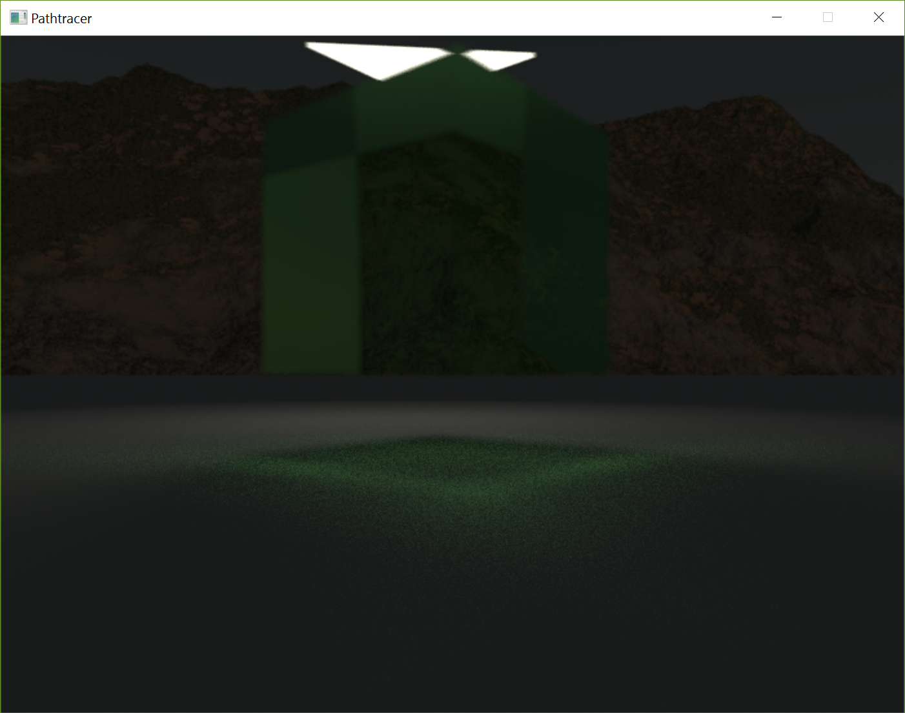
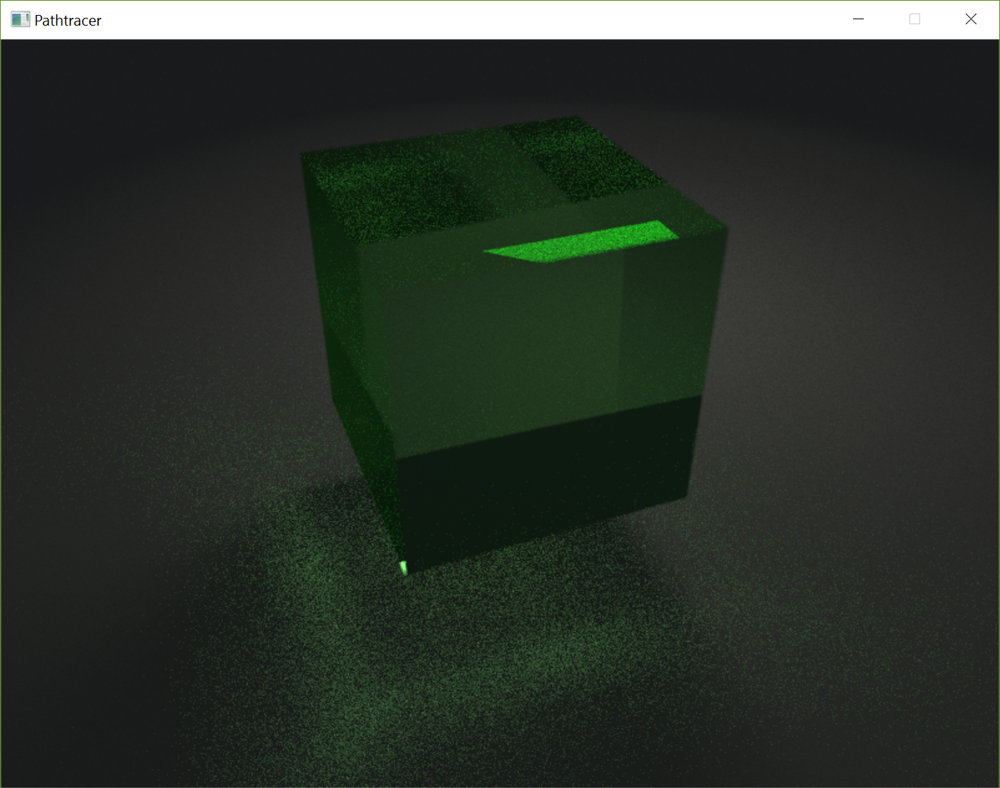
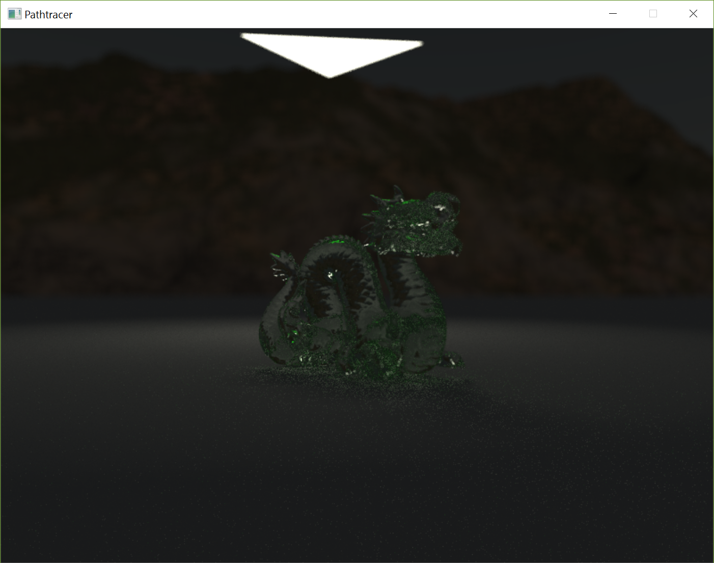
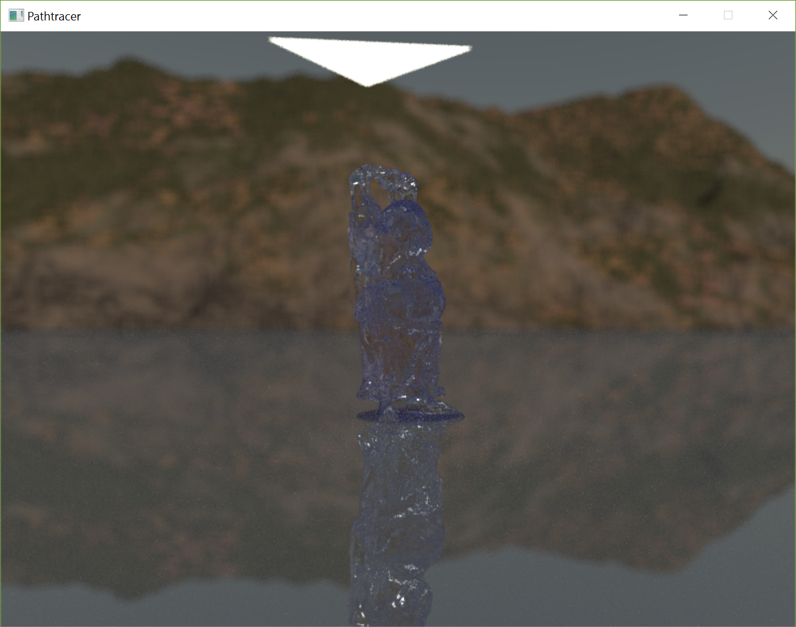

# Advanced Graphics: Physically based rendering Path Tracer in RUST
## Arian van Putten $4133935$ and Reinier Maas $4131495$

# Collaboration
For the course `Concepts of Program Design` we, Arian van Putten and Reinier Maas, were in the same team.
Although we were both working on different projects within this team.
Arian was working on a path tracer in Rust, because this is a realworld use-case for `Fearless concurrency` a selling point of the language we were studying.
Reinier was working together with Adolfo Ochagavía on implementing different backends for an exercise `IBAN Calculator` from `Concurrency`, to document the different programming concepts.

The third assignment for `Advanced Graphics` came up, implement a path tracer.
Reinier decided to check with Wouter Swierstra and Jacco Bikker if we could work together on implementing the path tracer.
Both because Reinier finds the language `Rust` interesting and because he had done the past two assingments without a practicum partner.
We were allowed to hand in this project for both courses with which we are very pleased.

Arian mainly focused on the `Fearless concurrency` part, thread scheduling without unsafe code to check how smart the compiler is.
Reinier mainly focused on implementing `Variance reduction` strategies, these were explained during the `Advanced Graphics` lectures.
Large parts of the project are our joined effort.

# Implementation
## Parallelism
For parallelizing the work of the path tracer we used a `scoped_threadpool` this is implemented as a library.
The program enters the scope and can execute work without dependecies easily acros different threads.

## Realistic materials
### Emissive
Emissive materials give light to a scene.
Their color component is the multiplication of it's intensity and it's actual color.
This saves recalculating the value on every evaluation.

### Diffuse
Diffuse materials reflect light from an arbitrary direction, while specular materials reflect light from a mirrored direction.
Diffuse surfaces have a color-component representing the color of the material, as well as a speculaty component which indicates the reflectiveness of the material.

### Dielectric
Dielectric materials are glass and water for example.
These materials absorb color the longer a ray stays inside the material.
This absorbance is according to `Beer's law` and is represented in the color component.
The mesh is defined as being the transistion between two materials.
This is why there are two refraction indexes specified with the dielectric material.
Most of the time refraction index one will be the refraction index of air, which is `one`.
Glass and water don't only refract the light arriving at their surfaces, but also reflect part of this light.
This is calculated depending on the incoming angle and the normal of the hit on the material using Schlick's approximation.
Based on this there is a chance that a ray will reflect or refract.
Because of the monte carlo integration over multiple samples this will converge to the correct solution.
Caustics are generated by random samples from a diffuse surface going through the glass and hitting a light source.
Therefore dielectric materials are as realistic in the 3D world as they are in the real world.

## Primitives
The primimitives implemented, implement a trait, as it is called in Rust, which defines their interface.
The first primitive in our application was the sphere, because we used a reference image that was easily checked when using a sphere as primitive.
Before we could load meshes we needed to be able to handle triangles.

## Meshes
To make loading easy we are using a library that loads `*.obj` files.
It is inspired upon `tiny object loader`.
The name of the library is `tobj`.
When loading obj files we convert them to our own triangle primitive.
We try to convert materials loaded with `tobj` to our own materials.
When no material is specified it uses a given backup material.

## Bounding Volume Hierarchy
As our acceleration structure we used the BVH.
The bouding volumes used in our BVH are Access Aligned Bounding Boxes.
We split the primitves over the different nodes of the BVH using the Surface Area Heuristic.
We use a three axis binned approach as our split-plane selector.
This creates 24 different bins 8 acros each axis, which gives us 21 different split-planes that are estimated with the SAH.
The SAH calculates the surface area of the AABB and multiplies this with the number of primitives inside.
The SAH is calculated for both sides of a split-plane and adding the estimates togehter.
Eventually the lowest estimated value is selected if it is lower then the SAH of the parent node.
This happens recursively for each node until there are no primitives to split-up, or the SAH estimates it is cheaper to leave the node alone.

## Gamma Correction
Gamma correction of the luminance of the rendered image is needed because classic CRTs didn't display the luminance linear.
In order to display the images correctly we applied gamma correction before sending the texture to the screen.
Current hardware doesn't need the image in a gamma corrected format but because of backwards commpatibility all hardware automatically translates frames back to linear luminance.

## Depth Of Field
Depth of field is hard to get realistic in rasterizers but with path tracing it becomes a simple addon.
A pinhole camera shoots rays from a pinpoint, the origin of the camera to a screenplane in front of this pinhole.
Upgrading this pinhole camera to a camera with an aperture and a focal plane is trivial.
Generate a circle on the location of the origin with a radius perpendicular to the view direction.
From this lens element we shoot rays towards our screenplane that is now located on our focal plane.

## Anti-aliasing
Anti-aliasing is used to diminish the jaggedness of the image.
By taking a random location around the location of the pixel on the focus plane we achieved this result.
This is added to the poisson process and only slightly impacts performance because there is only one sample per frame.

## Skybox
A skybox is used to generate nicer images.
All rays missing all the primitives sample the skybox to increasee the amount of light in the scene.
This generates a quicker convering image because there is more light then just the emitting surfaces.

## Compiler Checked Code
For Arians research it was important that the compiler gave us precise error messages.
For the compiler to give precise error messages we had to use as little unsafe as possible.
Unsafe code is not checked by the compiler and can do anything arbitrary, like introducing undefined behaviour.
In our code we only have _one_ line of unsafe code.
This specific line reads bytes from disk and transmutes them into floats for our skybox.

# Variance Reduction
## Important Sampling
Light on a diffuse surface gets reflected more if it arrives from the normal.
The random samples on a diffuse surface have an average chance of being sampled so the pdf is $1 / 2 \pi$.
When using the cosine weighted diffuse reflection, the sample has a greater chance of being sampled so the pdf is $R.dot(N) / \pi$.

## Next Event Estimation
On each diffuse surface we directly sample a random point on a random light.
This essentialy splits the direct and indirect illumination of the hemisphere.
According to the used pdfs in next even estimation we have to discard all rays traveling from a diffuse bounce to a lightsource.
The computation power spend on finding the intersection for these path segments is thus wasted.
In order increase efficiency of the path segments we have implemented `Multiple Important Sampling`.

## Multiple Important Sampling
The `Multiple Important Sampling`, `MIS`, is to overcome the waste of neglecting rays that hit the light after a diffuse bounce.
We implemented `MIS` which works by taking both the light pdf and the hemisphere pdf.
The light pdf is only greater then `zero` on the parts were a light is actually hit.
Therefore the light pdf is calculated when hitting a lightsource.
The hemisphere pdf can be calculated based on the direction of the light sample.
By combining the hemisphere pdf with the light pdf when doing the `Next Event Estimation`, `NEE`, this estimation is scaled down.
Because the `NEE` is scaled down we don't have to discard the rays that hit a lightsource after a diffuse bounce.
This reduces the overall variance.

## Many Lights
Many Lights estimates all lightsources by randomly sampling one lightsource.
The light recieved from this single lightsource is divided by the chance that the lightsource got sampled.
This way we added another Monte Carlo Intergral to our path tracer making generating of frames faster.
Eventually all lightsources will be sampled and the image converges to the correct solution.

## Russian Roulette
`Russian Roulette` comes into play when doing multiple bounces.
Each consecutive bounce reduces the transport of the ray.
If we are at a diffuse surface and we would do a diffuse bounce than we give the ray a chance to survive.
$$max(transport.R, transport.G, transport.B, 0.1)$$
With this formula the ray has a chance to survive corresponding to it's hightes color channel with a minimum of 10%.
Rays with that transport more energy will survive longer.
After a portion of the rays are killed we need to increase the energy returned by the rays that didn't get killed to compensate for killing the rays.
We scale them up by dividing them by their survival rate.
This way rays that survive bring back the energy that all rays would have returned together.

# Screenshots

Glass cube caustics front

Glass cube caustics top

Glass dragon on diffuse surface

Blue glass Buddha on semi specular surface
